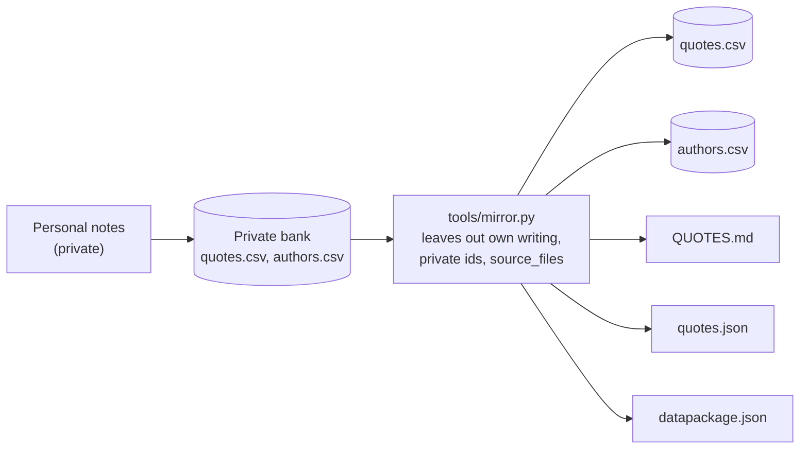

<!-- README.md | Markdown | created 2026-09-29 | what this repository holds, its files and columns, how it is updated -->

# quotebank

Quotations, poems, prose passages, proverbs and lyrics by public figures, collected by [Niklas Effenberger](https://nikefn.github.io). This repository is a public, filtered mirror of a private quote bank.

Read them in [QUOTES.md](QUOTES.md), grouped by category.

## How it works

1. Quotes are collected from personal notes into the private bank, where they are curated and, for part of them, checked against sources.
2. `tools/mirror.py` reads the private bank's `quotes.csv`, `authors.csv` and `tools/bank.py`, and writes the five data files here. It leaves out:
   - the collector's own writing
   - entries that may not be by a public figure
   - author rows no longer quoted
   - the `source_files` column, which names private notes
3. It stops without writing if a published entry refers to a left-out one, or if a published field contains the collector's name.
4. The files here are never edited by hand. Changes are made in the private bank and mirrored.

## Files

| File | Format | Content |
| --- | --- | --- |
| `QUOTES.md` | Markdown | Reading view. Categories in alphabetical order; within a category, entries by id, each original after its translation. Each shows text, author, source, id, and language and attribution where relevant. Generated. |
| `quotes.csv` | CSV | One row per entry, sorted by id. Generated. |
| `quotes.json` | JSON | `{"count": N, "entries": [...]}`. One object per entry with the columns of `quotes.csv`; `tags` is a list. Generated. |
| `authors.csv` | CSV | One row per author name used in `quotes.csv`, sorted by name (case-insensitive): dates, places, short biography. Generated. |
| `datapackage.json` | JSON | [Frictionless Data Package](https://datapackage.org) describing the three data files: path, format, encoding, creation date, description, and the columns with their allowed values. Generated. |
| `tools/mirror.py` | Python 3 | Regenerates the five files above from the private bank. |
| `README.md` | Markdown | This file. |
| `CLAUDE.md` | Markdown | Rules for agents working on this repository. |

Conventions:
- CSV files: UTF-8 without BOM, comma-separated, minimal quoting, LF line ends, one header row, no comment lines.
- Metadata for the CSV and JSON files is in `datapackage.json`, not in the files. The column descriptions in it come from the private bank's `tools/bank.py`.
- Markdown files start with a comment line: name, type, creation date, purpose. Python files start with a docstring that ends with the file name, type and creation date.
- Creation dates are the date of the file's first commit in this repository.

## quotes.csv / quotes.json

| Column | Content |
| --- | --- |
| `id` | `Q0001` upward. Permanent, never reused. Missing ids are entries that stay private. |
| `quote` | The text, in the language it was collected in. Verse lines are separated by ` / `. |
| `language` | ISO 639 code (`en`, `de`, `fr`, `la`, `grc`, `pi`, …). |
| `transliteration` | Romanisation of text not in Latin script. |
| `entry_type` | `quote`, `prose`, `poem`, `lyric` or `proverb`. |
| `author` | Person who said or wrote it; for film and television, the character. Empty: anonymous, proverb or unknown. |
| `source_work` | Most specific source known: work, chapter, letter, episode. |
| `category` | One theme per entry, e.g. Stoicism, Literature, Cities & Society. |
| `tags` | Keywords, `;`-separated in CSV, a list in JSON. |
| `attribution` | How far the sourcing was checked (below). |
| `translation_group` | Shared by a translation and its original, e.g. `tg-041`. |
| `notes` | Findings of the sourcing check and other remarks. |

| `attribution` | Meaning |
| --- | --- |
| `verified` | Traced to a named source. |
| `paraphrase` | Renders a real passage, shortened or reworded. |
| `reattributed` | The author in the original note was wrong and has been corrected. |
| `unverified` | Searched for and not found; the search is described in `notes`. |
| `original` | Original-language text of a translated entry. |
| `as-given` | Taken as written in the source note; not checked. |

## authors.csv

| Column | Content |
| --- | --- |
| `name` | Exactly as in `quotes.csv` `author`. |
| `status` | `bio` (person or group with a biography), `alias` (another spelling of a `bio` row), `traditional` (anonymous or handed-down source, or an unnamed character). |
| `alias_of` | For `alias` rows: the `name` of the `bio` row. |
| `born`, `died` | Year, `c. 563 BC`, `unknown` or `n/a (fictional)`. |
| `birthplace`, `deathplace` | Place names as they are called today. |
| `bio` | One paragraph. |
| `notes` | Remarks, e.g. disputed dates. |
| `checked` | What the biography was verified against. |

## Updating

Run on the machine that holds the private bank, then review and commit:

    python3 tools/mirror.py <path to the private bank>
    git diff
    git commit -am "Update mirror"

## Rights

The texts belong to their authors. The collection is published for personal, non-commercial use.
